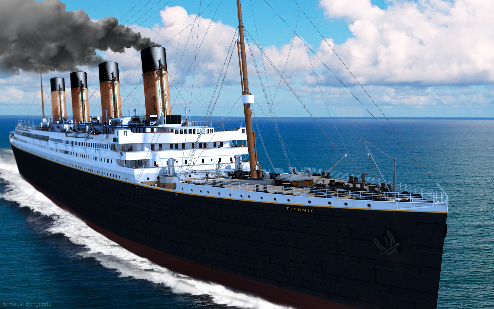

# Predicting Titanic Survivors

This [dataset](https://www.kaggle.com/c/titanic/data) contains information about 891 passengers who were aboard the ship when it sank in 1912. The goal is to predict whether the passengers survived or not.